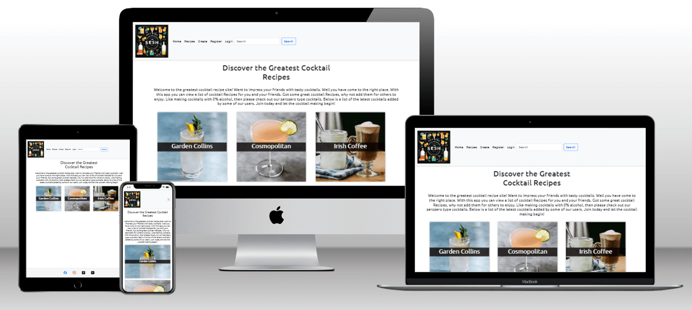

# The Sesh Recipes app

The Seesh Recipes App is a web application built using the Django web framework. This app is designed to help users easily sign up, create and view alcoholic and non-alcoholic recipes. It allows users to add, edit, and delete cocktails (which they created).

The live version of this app is located [The Seesh Recipes](https://sesh-recipes-d4bfd3561a5d.herokuapp.com/)

## Table Of Contents:
1. [Design](#design)
    * [User Stories](#user-stories)
    * [Agile Methodology](#agile-methodology)
    * [Database Diagram](#database-diagram)
    * [Features](#features)
    * [Future Features](#future-features)
    * [Technologies Used](#technologies-used)
    * [Testing](#testing)
    * [Deployment](#deployment)

# User Stories
User stories are a way to define the functionality and features of the cocktail recipe app from the perspective of the end users. Here are some user stories for a cocktail recipe app:
As a user, I want to be able to view and create cocktail recipes so I can make cocktails and share my recipes with other users.

- As a user, I can create an account in the app.
- As a user, I can login or logout from the app, so that can view the list of cocktails created by me and others.
- As a user, I want to be able to add cocktail recipes to the list to be viewed by other users.
- As a user, I should be able to click on the cocktail recipe in the list and see the instructions and ingredients about that cocktail recipe.
- As a user, I can edit an cocktail recipe on the list that I created so that I can update or make changes to that cocktail recipe.
- As a user, I should be able to delete cocktail recipes added by me.
- As a user, I want to be able to easily search for cocktail recipes in list to sperate different cocktail recipes by ingredients.
- As a user, I want to be able to view and edit my cocktail recipes on multiple devices (e.g., smartphone, tablet, web browser) for convenience and accessibility.    