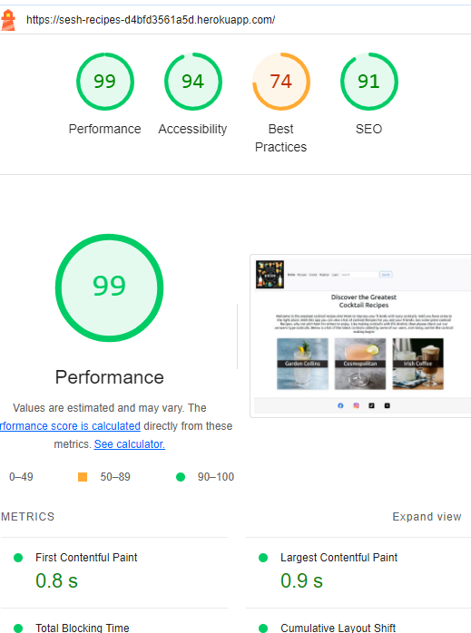

# The Sesh Recipes app

The Seesh Recipes App is a web application built using the Django web framework. This app is designed to help users easily sign up, create and view alcoholic and non-alcoholic recipes. It allows users to add, edit, and delete cocktails (which they created).

The live version of this app is located [here](https://sesh-recipes-d4bfd3561a5d.herokuapp.com/)

## Table Of Contents:
1. [Design](#design)
    * [User Stories](#user-stories)
    * [Agile Methodology](#agile-methodology)
    * [Wireframe](#wireframe)
    * [Database Diagram](#database-diagram)
    * [Features](#features)
    * [Future Features](#future-features)
    * [Testing](#testing)
    * [Deployment](#deployment)
    * [Technologies and sites used](#technologies-and-sites-used)
    * [Credits](#credits)

# User Stories
User stories are a way to define the functionality and features of the cocktail recipe app from the perspective of the end users. Here are some user stories for a cocktail recipe app:
As a user, I want to be able to view and create cocktail recipes so I can make cocktails and share my recipes with other users.

- As a user, I can create an account in the app.
- As a user, I can login or logout from the app, so that can view the list of cocktails created by me and others.
- As a user, I want to be able to add cocktail recipes to the list to be viewed by other users.
- As a user, I should be able to click on the cocktail recipe in the list and see the instructions and ingredients about that cocktail recipe.
- As a user, I can edit an cocktail recipe on the list that I created so that I can update or make changes to that cocktail recipe.
- As a user, I should be able to delete cocktail recipes added by me.
- As a user, I want to be able to easily search for cocktail recipes in list to sperate different cocktail recipes by ingredients.
- As a user, I want to be able to view and edit my cocktail recipes on multiple devices (e.g., smartphone, tablet, web browser) for convenience and accessibility.    

# Agile methodology

GitHub is a powerful platform for version control. In addition it can be effectively used to support agile methodologies. Github Projects was used to track the development of this app using the agile approach. The project can be found [here](https://github.com/users/Paulmayock/projects/1).

# Wireframe

This was used to map out a rough idea of what the app would look like

# Features

- **User-friendly design:** The app has a container desing which is accessible and user-friendly on various devices, including mobile phones and tablets.
 

- **User Sign up:** Users can sign up to create a account to add cocktail recipes.
 

- **User Sign in:** Users can sign in to their account.

- **Recipe List:** Users can view the list of cocktail recipes added.
 

- **Recipe Details:** Users can click on recipes to view ingredients and steps to making the cocktail selected.
 

- **Recipe Search:** User can search cocktail recipes from the list in the search bar. 
 

- **Add Recipe:** User who is signed up and logged in can add a cocktail recipe.

- **Edit Recipe:** Users who created recipes can edit their recipes in case a mistake is made when first adding the cocktail recipe. 
 

- **Delete Recipe:** Users who created a recipe can delete it.
 

- **Forgotten Password** Users who forget their password can email the app admin to has this reset.

# Future Features

Some features I would like to implement in future releases are as follows.
- Add a map so users can search locations of cocktail bars in their area and off-licenses.
- Add a rating system so users can rate cocktails.
- Add a option to add shot/shooter recipes.
- Add a more fixed search engine to search cocktails for time of year(sumemer, winter)

# Testing 

## User story testing
#### About The app 
*As a User I want to understand what the app is about.*
- On the app home page there is information that cleary tells the user the purpose of the app.

#### Sign up
*As a User I can Sign upto an account so that I can add my cocktail recipes to the the cocktail list.*
- On the app home page there is a Register button.  If a User clicks on this button, they will be redirected to the registeration page where they can sign up. Once they sign 
  up they will be able to create, access and edit the cocktail list they created.

#### Sign in/Logout
*As a user I can login and logout so I can have user priveledges over cocktails I created.*
- When a User is not logged in, the Login button is visible in the center of the app. When the user clicks on the login button, they are redirected to the sign in page where 
  they need to enter their user name and password. In the top right corner of the app the user will see the option to logout from the account.
- After clicking on Logout button, the user automatically redirected to the home page.

#### Recipe List
*As a user I can see the cocktail recipes list with an image attached of that cocktail.*
- When a user clicks on the Recipe button they can see the list of recipes added by users.

#### Recipe Details
*As a user I want to click on a cocktail recipe and see the type of cocktail, list of ingredients and instructions to make the cocktail*
- When a user clicks on a cocktail it shows the type of cocktail, the instructions and and ingredients to make that cocktail.

#### Recipe Search
*As a user I want to be able to search a cocktail recipe by either the cocktail name, spirit type, cocktail type or ingredients*
- On the footer page there is a search box. If a users enters a cocktail name, spirit type, cocktail type or ingredients
  a matching list should appear.

#### Adding a Cocktail Recipe  
*As a user I want to be able to add a cocktail recipe*
- Once a user is logged in they can click the Create button on the top of the app.
- The user can then create a cocktail by filling out all the required fields.
- Once filled out the user clicks create recipe and the recipe will be added to the cocktail recipe list.

#### Edit a Recipe
*As a user I want to be able to edit a cocktail which I created in case I need to edit the recipe*
- Once logged in a user can search recipes they created by searching their username. 
- When they click on a recipe their should be an option to edit the recipe.
- Only the user who created the recipe can edit the recipe.

#### Deleting a Recipe
*As a user I want to be able to delete a cocktail which I created in case I want it removed from the list*
- Once logged in a user can search recipes they created by searching their username. 
- When they click on a recipe their should be an option to delete the recipe.
- Only the user who created the recipe can delete the recipe.

#### Forgotten Password
*As a user I want an option to reset my password in case I forget it*
- If the user forgets their password or wants their password reset they can click login button on the home page.
- They will then see an option for forgot password.
- When they click this a message shows to email the sesh recipes email to reset password.

## Manual Testing
| Feature               | Test Performed                                                     | Result  |
|-----------------------|--------------------------------------------------------------------|---------|
| Register button | Clicking on the button redirects to the sign up form                     | Pass   |
| Login button | Clicking on the button redirect to the login form                          | Pass    |
| Logout button | When logged in the app, the link in the top right corner changes to Logout  | Pass    |
| Create cocktail | Once logged in clicking on the create button allows user to add a new recipe          | Pass    |
| Fill all fields when creating cocktail | All fields must be filled when creating cocktail or recipe will not be created         | Pass    |
| Edit cocktail | Clicking on the recipe the user created opens details which can be edited | Pass    |
| Delete cocktail  | Clicking on the recipe the user created opens details wherea button to delete recipes is present | Pass    |
| Search recipe | Entering a cocktail name, spirit type, cocktail type or ingredients, a matching list should appear  | Pass    |
| Header title  | Make sure that the correct title displayed when open either the Add or Edit form  | Pass    |
| Responsiveness | The app layout changes depending on the viewed devices         | Pass      |
| Social icons | When clicking on a social icon in the footer it opens the correct web address in the new tab       | Pass      |

## Code Validation

#### HTML validation

#### CSS Validation

### PEP Validation

##### Admin.py Validation

##### Apps.py Validation

##### Models.py Validation

##### Urls.py Validation

##### Views.py Validation

### Lighthouse

##### Home page

##### Recipes page

##### SignIn Page

##### Create page

## Deployment

#### Heroku

- The requirements.txt file in the IDE must be updated to package all dependencies. To do this:

- Enter the following into the terminal: 'pip3 freeze > requirements.txt'
- Commit the changes and push to GitHub
- Sign in to heroku

- On the heroku dashboard click the create new app button

- Name the app something unique and choose what region you are in then click create app

- Go to the settings tab and the config vars section. Click reveal config vars

- Add the cloudinary_url, databse_url and secret_key plus their values in the fields

- In the field for VALUE copy and paste the entire contents of your creds.json file from your project. Then click add

- Scroll down to the Buildpacks section and click add buildpack

- Click Python then save changes

- Make sure that Python appears above Nodejs in the buildpack section. If it does not you can click and drag them to change the order

- Go to the deploy section by clicking deploy from the nav bar at the top of the page

- On the deployment method section select GitHub and click connect to GitHub

- Enter the repository name as it is in GitHub and click search

- Click the connect button next to the repository to link it to heroku

- To deploy, scroll down and click the deploy branch button

- Heroku will notify you that the app was successfully deployed with a button to view the app

 # Technologies and sites used
- Django - Free and open-source, Python-based web framework that follows the model–template–views (MTV) architectural pattern.
- Python - General-purpose programming language. 
- Bootstrap - Free front-end framework for faster and easier web development.
- HTML - The standard markup language for Web pages.
- CSS -  style sheet language used for describing the presentation of a document written in a markup language such as HTML.
- JavaScript - lightweight interpreted  programming language with first-class functions.
- Pixlr - AI image generator to generate images by describing what you require.
- Github - platform and cloud-based service for software development and version control using Git.
- Gitpod - cloud development environment to efficiently and securely develop software. 
- Heroku - platform as a service (PaaS) that enables developers to build, run, and operate applications entirely in the cloud.
- Liquor.com - Website dedicated to inspire those to make cocktails

## Credits

- Code Institute's 'Hello Django" and "I Think Therefore I Blog" walk through provided fundamentals of creating a project with Django.

- Daisy Mcgirr and David Bowers who helped me with my project setup and ideas for a project and throughout.

- StackOverflow and Slack communinity for tips on how to write some of code for my project.